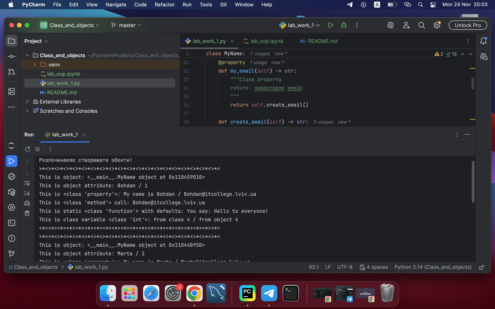
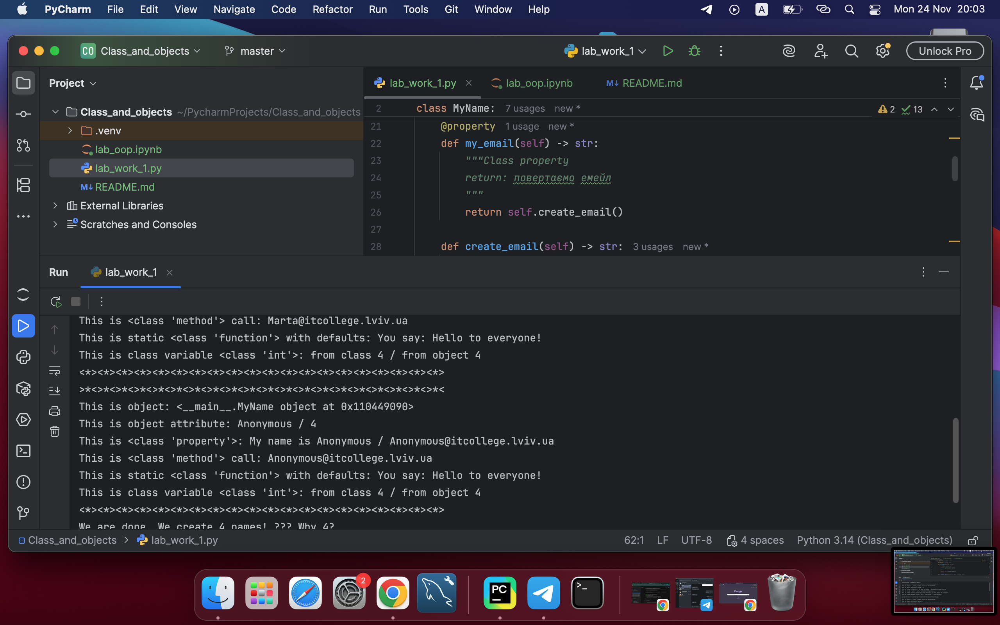
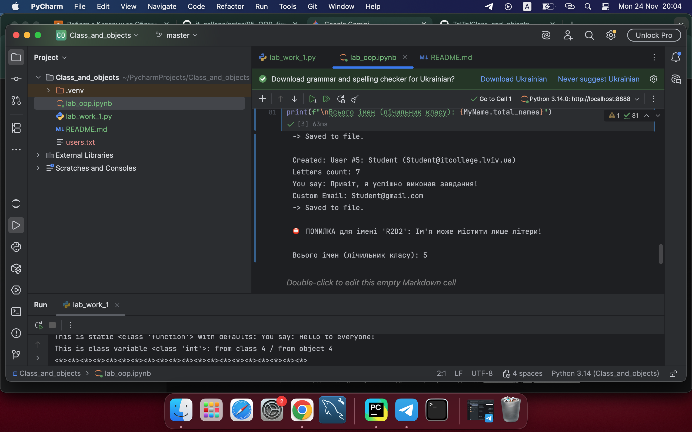
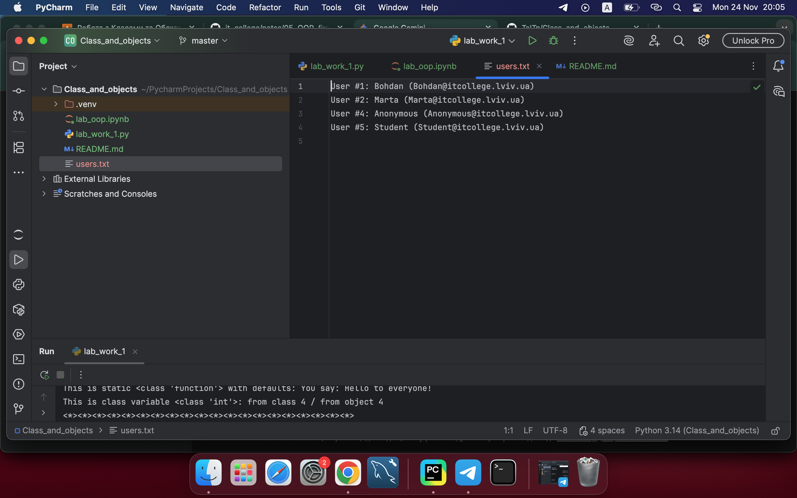

# Звіт до лабораторної роботи №1
## Тема: Перша програма на ООП
### Виконав: студент групи [Твоя група] [Твоє Прізвище та Ім'я]

---

### Мета роботи
Навчитися створювати прості класи в Python, працювати з конструктором `__init__`, атрибутами класу та об'єкта, методами (instance, class, static) та властивостями (`@property`).

---

### Хід роботи

#### 1. Запуск початкової програми
Я ознайомився з кодом, наданим у лекції, та запустив його у IDE.

**Результат виконання програми:**




*На скріншоті видно створення 3 об'єктів та вивід їхніх параметрів.*

---

#### 2. Відповіді на контрольні запитання

1.  **Чому коли передаємо значення `None` створюється об'єкт з іменем `Anonymous`?**
    У конструкторі класу прописана логіка через тернарний оператор: `self.name = name if name is not None else self.anonymous_user().name`. Якщо передане значення `None`, викликається клас-метод `anonymous_user`, який повертає об'єкт з ім'ям за замовчуванням ("Anonymous").

2.  **Чому маємо різну кількість імен (у списку 3, а `total_names` 4)?**
    Це відбувається через спосіб створення анонімного користувача. Коли програма бачить `None`, вона викликає `anonymous_user()`. Цей метод створює **новий (тимчасовий)** екземпляр класу `MyName`. Під час створення цього тимчасового об'єкта спрацьовує конструктор `__init__`, і змінна класу `total_names` збільшується на 1. Потім ми створюємо основного об'єкта, і лічильник збільшується ще раз.

---

#### 3. Виконання індивідуальних завдань

Я модифікував програму згідно з завданням. 

**Внесені зміни:**
1.  Додано моє ім'я в список `names`.
2.  Додано валідацію: якщо ім'я містить цифри, виникає помилка `ValueError`.
3.  Реалізовано автоматичну капіталізацію імені (перша літера велика).
4.  Змінено метод `create_email` (можливість зміни домену).
5.  Додано метод `count_letters` (підрахунок довжини імені).
6.  Додано властивість `full_name`.
7.  Реалізовано метод `save_to_file` для запису даних у текстовий файл.

**Мій код:**
```python
class MyName:
    total_names = 0 

    def __init__(self, name=None) -> None:
        raw_name = name if name is not None else self.anonymous_user().name
        
        # Валідація (Індивідуальне завдання)
        if not raw_name.isalpha():
             raise ValueError(f"Ім'я '{raw_name}' має містити лише літери!")
        
        # Капіталізація (Індивідуальне завдання)
        self.name = raw_name.capitalize()
        
        MyName.total_names